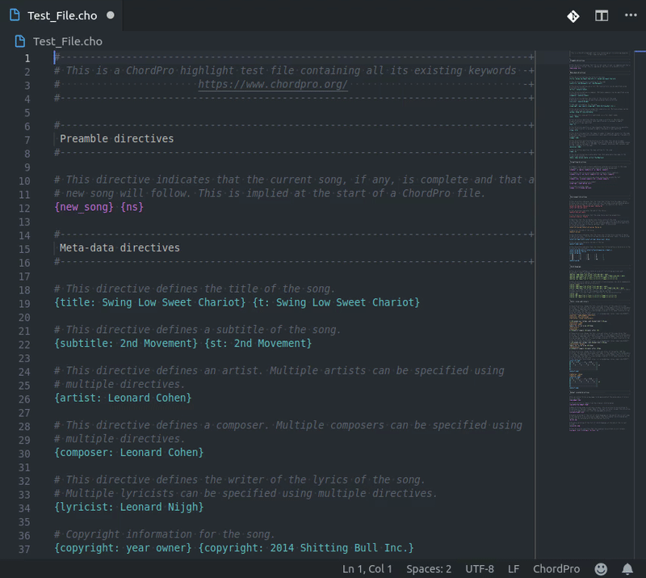

# Visual Studio Code ChordPro Extension

This extension provides ChordPro files support for VS Code.

> [ChordPro](https://www.chordpro.org/) (also known as Chord) is an ASCII
> text file format for transcribing songs with chords and lyrics.  
> Although this format is legible as it is, there are many popular programs for
> displaying, transposing and printing.  
> Files in this format often have extensions such as `.crd`, `.chopro`, `.pro`,
> `.chordpro` or `.cho`. [[wiki](https://en.wikipedia.org/wiki/ChordPro)]

## Features

- [x] Full syntax highlighting
- [x] Comprehensive syntax snippets (28+)
- [x] Rendering preview window
- [x] Export to PDF songbook

## Snippets

This extension includes a large collection of snippets to speed up your songwriting. Many snippets support **selection wrapping** (select text and type the snippet prefix to wrap it).

### Headers & Metadata

| Feature      | Prefix(es)       | Result                  |
| ------------ | ---------------- | ----------------------- |
| Title        | `title`, `t`     | `{title: ...}`          |
| Subtitle     | `subtitle`, `st` | `{subtitle: ...}`       |
| Basic Header | `header`         | Title and Key block     |
| Full Header  | `fullheader`     | Complete metadata block |

### Sections

| Feature | Prefix(es)             | Result                                  |
| ------- | ---------------------- | --------------------------------------- |
| Chorus  | `cdef`, `chorus`, `ch` | `{start_of_chorus} ... {end_of_chorus}` |
| Verse   | `vdef`, `vlabel`       | `{start_of_verse} ... {end_of_verse}`   |
| Bridge  | `bridge`, `br`         | `{start_of_bridge} ... {end_of_bridge}` |
| Tab     | `tab`                  | `{start_of_tab} ... {end_of_tab}`       |

### Formatting & Musical Notation

| Feature        | Prefix(es)      | Result                       |
| -------------- | --------------- | ---------------------------- |
| Inline Chord   | `chord`         | `[...]`                      |
| Comment        | `comment`, `c`  | `{comment: ...}`             |
| Italic Comment | `ci`            | `{comment_italic: ...}`      |
| Staff          | `staff`         | 4-bar musical staff template |
| Define         | `def`, `ukedef` | Custom chord diagrams        |

> [!TIP]
> Type `chordpro` in the snippet search to see all available options!

## Requirements

None in this version.

## Extension Settings

None in this version.

## Known Issues

None.

## Release Notes

This is the first release of VS Code ChordPro extension.  
With it comes syntax highlighting support for one of the best song lyrics and
chords format.

Future releases will have, at some point in time, improvements in the
highlighting (add coloring by groups), and what's listed on the check list, in
the [Features](#Features) section.

To check the latest changes, read the [CHANGELOG.md](CHANGELOG.md).

## Contributing

All contributions are more than welcome! If you want to get started with a PR,
please do the following:

1. Fork and clone this repository.
2. Run `npm install` to install dependencies.
3. Open the repository in VS Code.
4. Press `F5` to launch the Extension Development Host and test your changes.
5. Update the [CHANGELOG.md](CHANGELOG.md) with details of your changes.
6. Submit a Pull Request!

## License

This extension is licensed under the [MIT License](LICENSE.txt).
